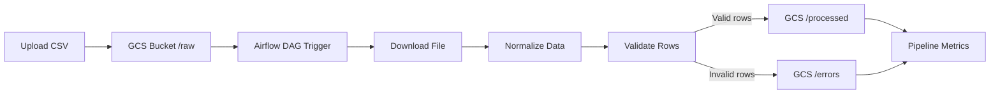

# Airflow GCP Data Pipeline 🚀

End-to-end data pipeline built with **Apache Airflow** and **Google Cloud Platform (GCS)**.

This project processes raw CSV files uploaded to a cloud bucket, validates the data, and separates valid and invalid records automatically.

It demonstrates key data engineering concepts:
- Workflow orchestration with Airflow
- Cloud storage pipelines
- Data validation and cleaning
- Idempotent processing using file hashing
- Production-style project structure

---

## Architecture 🏗️



Pipeline flow:
1. A file is uploaded to the **raw** folder in a GCS bucket
2. Airflow detects the file
3. The pipeline processes the dataset
4. Clean data and invalid rows are stored separately

---

## Idempotent Processing 🔁

The pipeline uses **content hashing** to avoid processing the same file twice.

Each uploaded file generates a unique hash:

```
users_cleaned_<file_hash>.csv
invalid_rows_<file_hash>.csv
```

This ensures:
- No duplicated processing
- Safe re-runs
- Reliable pipeline behavior

---

## Project Structure 📂

```
airflow-gcp-data-pipeline/
│
├── dags/
│   └── user_pipeline_dag.py
│
├── pipeline/
│   ├── pipeline_runner.py
│   ├── cleaning.py
│   ├── validation.py
│   ├── storage.py
│   └── utils.py
│
├── data_sample/
│   └── users_test.csv
│
├── requirements.txt
└── README.md
```

---

## How the Pipeline Works ⚙️

### 1. File Detection
Airflow monitors the bucket for new files.

### 2. Data Cleaning
The pipeline standardizes:
- column names
- string formatting
- data types

### 3. Data Validation
Rows are validated using business rules:
- valid email
- valid age
- correct subscription tier
- required schema

### 4. Storage
Outputs are saved into separate folders:

```
raw/
processed/
errors/
```

---

## Example Pipeline Execution

Upload a file:

```
raw/users_test.csv
```

Outputs generated:

```
processed/users_cleaned_<hash>.csv
errors/invalid_rows_<hash>.csv
```

---

## Tech Stack 🧰

- Apache Airflow
- Google Cloud Storage (GCS)
- Python
- Pandas

---

## Key Engineering Concepts Demonstrated

- DAG-based orchestration
- Cloud-native pipelines
- Data validation frameworks
- Idempotent ETL design
- Modular pipeline architecture

---

## Future Improvements 💡

Possible next steps:

- Event-driven pipeline (instead of scheduled DAG)
- Data quality monitoring
- Logging dashboard
- Partitioned datasets
- BigQuery integration
- CI/CD deployment

---

## Author

Matías Terraza
Data Analyst / Analytics Engineering
